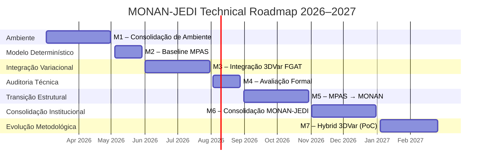

# Cronograma Técnico – MONAN-JEDI 2026–2027

## 1. Visão Geral do Cronograma

Início operacional considerado em **02/03/2026**.
O cronograma foi estruturado de forma progressiva, cumulativa e com paralelismo real entre as áreas:

* Infraestrutura & Spack
* MONAN/MPAS
* Observações
* Núcleo Variacional (JEDI)
* Avaliação & Métricas
* Documentação & Reprodutibilidade

Cada milestone possui critérios objetivos de avanço.
A progressão depende de evidência técnica validada, não apenas de prazo calendário.

A arquitetura segue a sequência:

Ambiente → Modelo Determinístico → 3DVar FGAT → Avaliação Formal → Transição MONAN → Consolidação → Hybrid (PoC)

---

# 2. Tabela Resumo

| Milestone                         | Período                 | Responsável Primário | Dependências |
| --------------------------------- | ----------------------- | -------------------- | ------------ |
| [M1 – Consolidação de Ambiente](https://github.com/joaogerd/monan-jedi-2026/milestone/1)     | 02/03/2026 – 30/04/2026 | Rodrigo Braz         | —            |
| [M2 – Baseline Determinístico MPAS](https://github.com/joaogerd/monan-jedi-2026/milestone/2) | 04/05/2026 – 29/05/2026 | Eder Vendrasco       | M1           |
| [M3 – Integração 3DVar FGAT](https://github.com/joaogerd/monan-jedi-2026/milestone/3)        | 01/06/2026 – 31/07/2026 | Joao Gerd            | M1, M2       |
| [M4 – Avaliação Formal MPAS-JEDI](https://github.com/joaogerd/monan-jedi-2026/milestone/4)   | 03/08/2026 – 28/08/2026 | Liviany Viana        | M1, M2, M3   |
| [M5 – Transição MPAS → MONAN](https://github.com/joaogerd/monan-jedi-2026/milestone/5)       | 31/08/2026 – 30/10/2026 | Eder Vendrasco       | M1–M4        |
| [M6 – Consolidação MONAN-JEDI](https://github.com/joaogerd/monan-jedi-2026/milestone/6)      | 02/11/2026 – 31/12/2026 | Joao Gerd            | M1–M5        |
| [M7 – Hybrid 3DVar (PoC)](https://github.com/joaogerd/monan-jedi-2026/milestone/7)           | 04/01/2027 – 26/02/2027 | Joao Gerd            | M1–M6        |

OBS: M6 e M7 ocorre parcialmente em período de recesso e férias. Execuções críticas após 20/01/2027.

---

# 3. Descrição Consolidada das Milestones

## M1 – Consolidação de Ambiente

Congelamento do ambiente Spack, geração de spack.lock, padronização de build via PBS e validação cruzada de reprodutibilidade.

Critério de avanço:
Ambiente recriado por múltiplos membros sem intervenção informal.

---

## M2 – Baseline Determinístico MPAS

Execução do MPAS-A oficial por 7 dias consecutivos, com estabilidade numérica comprovada e métricas de performance registradas.

Critério de avanço:
Relatório formal de baseline produzido.

---

## M3 – Integração 3DVar FGAT

Implementação do ciclo completo 3DVar FGAT com pipeline IODA + UFO e execução contínua de 7 dias.

Critério de avanço:
Minimização convergente e métricas O–B e O–A estáveis.

---

## M4 – Avaliação Formal

Auditoria técnica completa do MPAS-JEDI antes da transição para MONAN.

Critério de avanço:
≥ 95% dos ciclos executando sem falha e relatório técnico aprovado.

---

## M5 – Transição Controlada para MONAN

Substituição do MPAS-A oficial pelo MONAN, validação de compatibilidade estrutural e execução estável de 7 dias.

Critério de avanço:
Relatório comparativo MPAS vs MONAN aprovado.

---

## M6 – Consolidação MONAN-JEDI

Estabilidade prolongada, auditoria de reprodutibilidade e consolidação institucional do sistema.

Critério de avanço:
Sistema reproduzido por múltiplos membros e estabilidade ≥95%.

---

## M7 – Hybrid 3DVar (Prova de Conceito)

Implementação híbrida controlada com ensemble reduzido e avaliação de custo-benefício.

Critério de encerramento:
Relatório formal de viabilidade e decisão institucional registrada.

---

# 4. Linha do Tempo Estratégica (Gantt – Mermaid)

Adicionar no `README.md`:

---

# 5. Observações Estratégicas

* Não há sobreposição estrutural entre milestones.
* Existe paralelismo interno em todas as áreas durante cada marco.
* A progressão depende de critérios técnicos formais.
* O marco final (M7) encerra o ciclo 2026–2027 com decisão institucional registrada.

---

# 6. Paralelismo entre Áreas

Durante todas as milestones:

Infraestrutura nunca para
Modelo nunca para
Observações nunca param
Variacional nunca para
Avaliação nunca para
Documentação nunca para

Cada fase distribui atividades simultâneas:

* Infraestrutura valida estabilidade
* Modelo fornece estado
* Observação estrutura ingestão
* Variacional ajusta ciclo
* Avaliação produz métricas
* Documentação consolida evidências

Nenhuma área depende exclusivamente do término total de outra para trabalhar.

---

Pronto. Aguardando confirmação para seguir para Issues.
